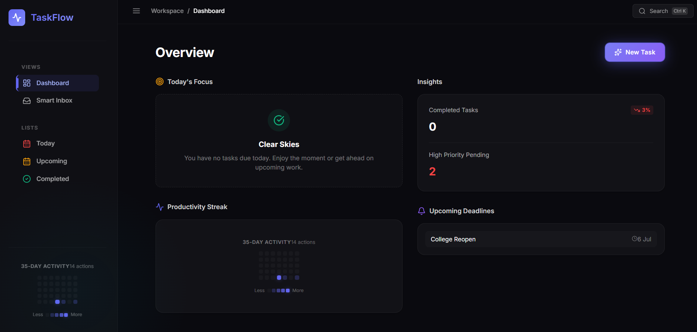
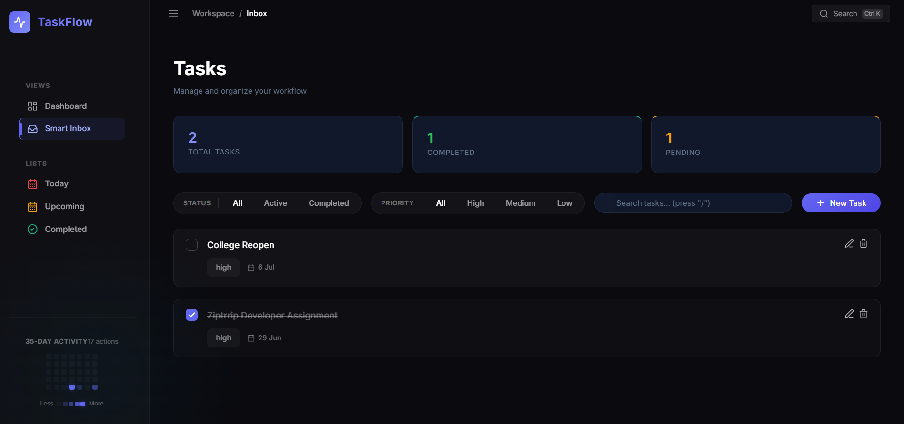
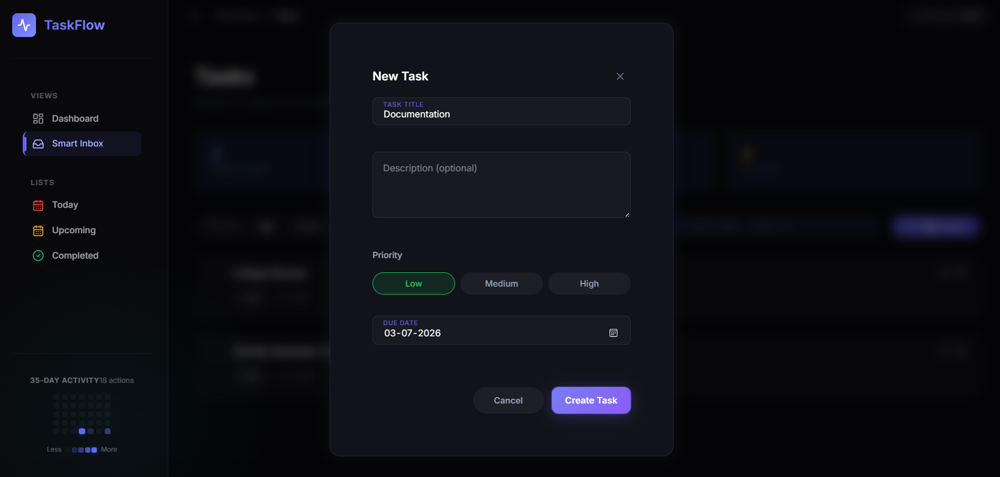

# TaskFlow Todo Application

**Live Demo:** [https://taskflow-todo-app-lime.vercel.app/](https://taskflow-todo-app-lime.vercel.app/)

A full-stack todo application built with React 18, Express.js, and LibSQL (SQLite on the edge). Designed with modern UI/UX patterns including a premium dark theme, glassmorphism, activity tracking, and a fully responsive mobile layout.

## App Screenshots

| Landing Page | Dashboard |
|---|---|
|  |  |
| **Smart Inbox** | **Task Modal** |
|  |  |

## Quick Start

### Prerequisites
- Node.js 18 or higher
- npm 9 or higher

### Installation & Setup

1. Clone the repository:
```bash
git clone <your-repo-url>
cd todo-app
```

2. Start the backend:
```bash
cd backend
npm install
npm start
```

3. In a NEW terminal, start the frontend:
```bash
cd frontend
npm install
npm run dev
```

| Service  | URL                     |
|----------|-------------------------|
| Backend  | http://localhost:3001    |
| Frontend | http://localhost:5173    |

## Architecture

### Tech Stack

| Layer     | Technology             | Rationale                                                              |
|-----------|------------------------|------------------------------------------------------------------------|
| Frontend  | React 18               | Component-based UI with hooks for state management                     |
| Routing   | React Router v6        | Multi-page architecture (not SPA) as required                          |
| Bundler   | Vite                   | Fast HMR and modern build tooling                                      |
| Styling   | Vanilla CSS            | Full control via CSS Custom Properties, no framework overhead          |
| Backend   | Express.js             | Lightweight Node.js REST framework                                     |
| Database  | LibSQL (Turso)         | Edge-ready SQLite implementation for serverless compatibility          |

### Folder Structure

```text
todo-app/
├── backend/
│   ├── server.js            # Express server entry point
│   ├── db.js                # LibSQL database connection logic
│   ├── routes/
│   │   └── todos.js         # REST API routes (CRUD + filtering)
│   ├── .env                 # Environment variables for DB connection
│   └── package.json
│
├── frontend/
│   ├── index.html           # Vite entry HTML
│   ├── vite.config.js       # Vite config with API proxy
│   ├── src/
│   │   ├── main.jsx         # React entry point with BrowserRouter
│   │   ├── App.jsx          # Root component, theme state, routes
│   │   ├── index.css        # Complete CSS design system
│   │   ├── components/      # Reusable UI components
│   │   ├── utils/           # Helper functions (e.g., calendar generation)
│   │   └── pages/           # Route-level components
│   └── package.json
│
├── vercel.json              # Vercel deployment configuration
├── README.md                # This file
├── API.md                   # API endpoint documentation
└── FEATURES.md              # Feature list and design decisions
```

## Keyboard Shortcuts

| Shortcut  | Action                | Context                  |
|-----------|-----------------------|--------------------------|
| `/`       | Focus search bar      | When no input is focused |
| `N`       | Open new task modal   | When no input is focused |
| `Escape`  | Close modal           | When modal is open       |

## Development Notes

- **Backend auto-reload**: Use `npm run dev` to start with `node --watch` for automatic restart on changes.
- **Frontend HMR**: Vite provides instant hot module replacement during development.
- **API proxy**: Vite forwards all `/api/*` requests to `http://localhost:3001` during development.

## Documentation

- [API.md](./API.md) - Complete endpoint documentation with request/response examples.
- [FEATURES.md](./FEATURES.md) - Comprehensive feature list and design decisions.

## License

This project was developed for educational purposes
